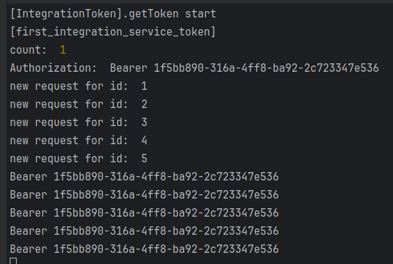
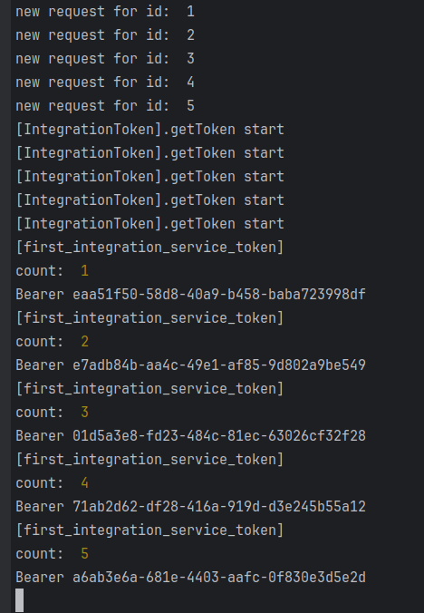

```bash
$ npm install
# watch mode
$ npm run start:dev
```

перейти в за писиланням:</br>
http://localhost:3000/get_data_1</br>

 очікується:</br>
</br>
один токен для всіх промісів в Promise.all(promises)</br>

по факту:</br>
</br>
для кожного з 5-ти промісів окремі токени</br>

для збільшення часу життя токена першого сервісу в TokenController на 13 стрічці збільшини число</br>
